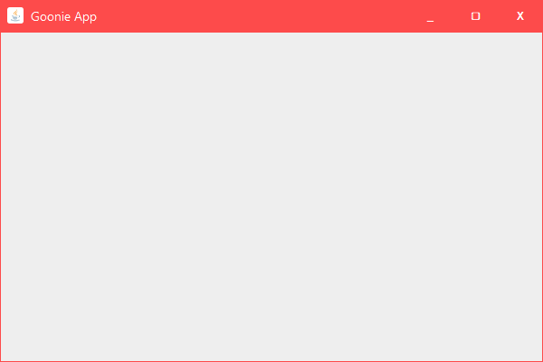

# FrameX - Custom Java Swing Window Framework

FrameX is a lightweight Java Swing framework for creating modern, customizable undecorated windows with built-in title bar controls, resizing, and drag-to-move functionality.


## Features

- Custom title bar with icon, title, and window controls  
- Resizable from all edges and corners  
- Draggable window  
- Minimize, maximize/restore, and close buttons  
- Double-click title bar to maximize/restore  
- Customizable colors and padding  
- Built-in fullscreen support
  
## Features Not Well Implemented 
- Setting window to normal if dragged while fullscreen, it jumps to 0,0
- It doesnt snap to full screen if dragged to extreme to
- It doesnt snap on the sides if dragged to extreme sides
- It doesnt appear in list of open windows when splitting screen

## Installation

Simply include the FrameX package in your Java project. The framework consists of these main classes:

- `Frame` - Main window container  
- `TitleBar` - Custom title bar component  
- `WindowControls` - Minimize/maximize/close buttons  
- `Button` - Custom button factory  
- `WindowDragSupport` - Handles window dragging and resizing  

## Basic Usage

### Creating a Simple Window

```java
import concrete.goonie.framex.Frame;

public class Main {
    public static void main(String[] args) {
        // Create a basic window with default title
        Frame frame = new Frame();
        
        // Create a window with custom title
        Frame frame2 = new Frame("My Application");
        
        // Create window with title and content panel
        JPanel content = new JPanel();
        content.add(new JLabel("Hello World!"));
        Frame frame3 = new Frame("Hello App", content);
    }
}
```

### Customizing the Window

```java
import javax.swing.*;
import java.awt.*;

public class CustomExample {
    public static void main(String[] args) {
        // Create content panel
        JPanel content = new JPanel();
        content.add(new JButton("Click Me"));
        
        // Create frame with customizations
        Frame frame = new Frame("Custom Window", content);
        
        // Set window colors
        frame.setFrameColor(new Color(45, 45, 45));
        frame.setContentBackground(new Color(60, 60, 60));
        
        // Add padding around content
        frame.setPadding(10, 10, 10, 10);
        
        // Set window icon
        frame.setIconImage("path/to/icon.png");
    }
}
```

### Advanced Example with Dynamic Content

```java
import javax.swing.*;
import java.awt.*;
import java.awt.event.ActionEvent;
import java.awt.event.ActionListener;

public class DynamicExample {
    public static void main(String[] args) {
        // Create initial content
        JPanel content = new JPanel(new BorderLayout());
        JLabel label = new JLabel("Current content", SwingConstants.CENTER);
        content.add(label, BorderLayout.CENTER);
        
        // Create frame
        Frame frame = new Frame("Dynamic Content", content);
        frame.setFrameColor(new Color(30, 30, 30));
        
        // Create control panel
        JPanel controls = new JPanel();
        
        // Button to change content
        JButton changeBtn = new JButton("Change Content");
        changeBtn.addActionListener(e -> {
            JPanel newContent = new JPanel();
            newContent.add(new JLabel("New content loaded at " + System.currentTimeMillis()));
            frame.setContent(newContent);
        });
        
        // Button to toggle fullscreen
        JButton fullscreenBtn = new JButton("Toggle Fullscreen");
        fullscreenBtn.addActionListener(e -> {
            WindowDragSupport.toggleFullscreen(frame.getFrame());
        });
        
        controls.add(changeBtn);
        controls.add(fullscreenBtn);
        
        content.add(controls, BorderLayout.SOUTH);
    }
}
```

## API Reference

### Frame Class

```java
// Constructors
Frame()
Frame(String title)
Frame(String title, JPanel content)
Frame(String title, JPanel content, String iconPath)

// Methods
void setTitle(String title)
void setIconImage(String path)
void setContent(JPanel content)
void setPadding(int top, int left, int bottom, int right)
void setContentBackground(Color color)
void setFrameColor(Color color)
JFrame getFrame()
JPanel getContentPanel()
TitleBar getTitleBar()
```

### Button Utility Class

```java
// Static factory method
static JButton createButton(String text, Color hoverColor)
```

## Customization Tips

**Colors**: Use `setFrameColor()` and `setContentBackground()` to match your application theme  
**Padding**: Adjust padding with `setPadding()` to create proper spacing  
**Icons**: Use PNG icons with transparent backgrounds for best results  
**Resizing**: Set minimum content size to prevent window from becoming too small  
**Fullscreen**: Double-click title bar or use `WindowDragSupport.toggleFullscreen()`

## License

FrameX is released under the MIT License.
